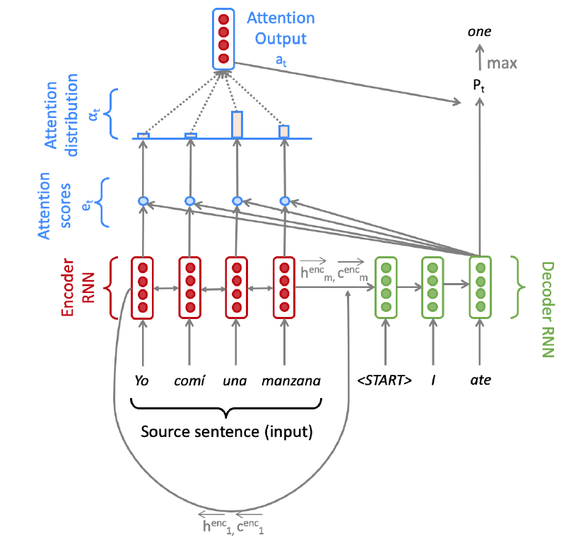
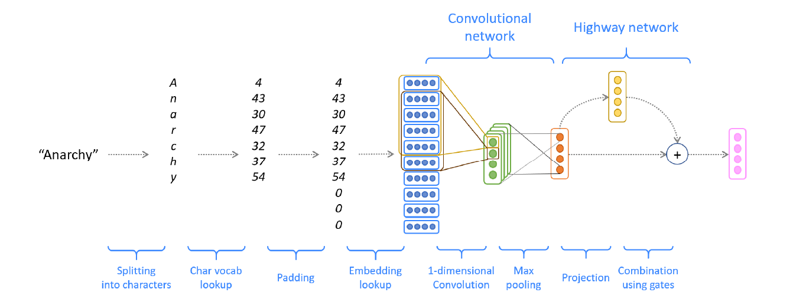

# 向NLP之路奋进
## 比赛项目：kaggle competition--Tweet sentiment extraction(Top 6%)
+ [项目代码](https://github.com/wuzhixin1010/Practice/tree/master/%E7%89%B9%E5%BE%81%E6%8F%90%E5%8F%96Kaggle-Tweet%20sentiment%20extration)
### 1.Background
在这个比赛中，我们得到一个包含有特定情绪的tweet的数据集，我们将挑选出tweet中反映该情绪的部分(单词或短语)。因此，我们的训练集包含三个列，包括tweet、sentiment和selected_text(word或phrase)。在测试集中，我们将预测selected_text。
### 2.Dataloader
处理数据的时候就是要把文本转化成token，然后把情感和推特文本拼接成一个句子，还要找出训练集中selected_text对应token在推特文本对应token中的开始和结束位置，然后要把每个句子padding成最大长度。
### 3.Model
整个模型包含三个模型的融合，三个模型都是Roberta_base，模型以一定的权重融合。
## 课程项目：NMT with RNNs(CS 224N)(英语->法语)
### 1.使用带attention的Seq2Seq模型([参考pdf](https://github.com/wuzhixin1010/Practice/blob/master/%E6%9C%BA%E5%99%A8%E7%BF%BB%E8%AF%91cs224N/%E5%8F%82%E8%80%83pdf/a4.pdf))
+ [项目代码](https://github.com/wuzhixin1010/Practice/tree/master/%E6%9C%BA%E5%99%A8%E7%BF%BB%E8%AF%91cs224N/CS224N-a4/a4)
+ 实现decoder(LSTM)对encoder(Bidirection-LSTM)的attention(weight-attention)（[参考论文](https://arxiv.org/pdf/1409.0473.pdf)）

### 2.Embedding—Character-based convolutional encoder([参考pdf](https://github.com/wuzhixin1010/Practice/blob/master/%E6%9C%BA%E5%99%A8%E7%BF%BB%E8%AF%91cs224N/%E5%8F%82%E8%80%83pdf/a5.pdf))
+ [项目代码](https://github.com/wuzhixin1010/Practice/tree/master/%E6%9C%BA%E5%99%A8%E7%BF%BB%E8%AF%91cs224N/CS224N-a5)

## 练习项目：使用Bert实现情感分类(Kaggle Tweet数据集) 
+ [项目代码](情感分类/bert_sentiment_clasifacation.ipynb)
+ 文本数据清洗
+ 对Bert输入数据的探索

## 练习项目：Kaggle 机器学习基础练习——泰坦尼克号  
+ [项目代码](机器学习—泰坦尼克号/tatannic.ipynb)
+ 特征工程(Pandas)
+ RL，SVM(Sklearn)

## 其它练习
### python实现基础的数据结构和算法
### pytorch的基础操作
+ CNN、RNN做分类任务(Mnist)  [代码](pytorch的基础练习/pytorch-10CNN.py)
